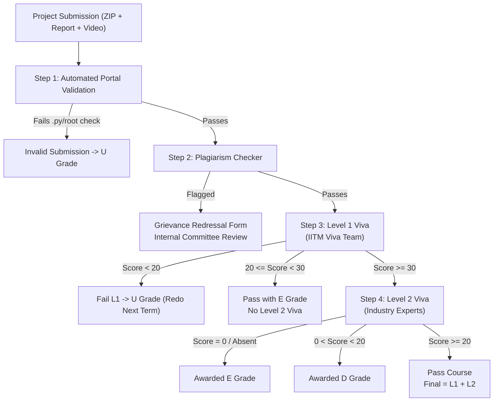

# MAD - 2 Project and Viva Instructions (T32026)

> **Official Document Reference**: IIT Madras BS in Data Science and Applications — Modern Application Development II (CS2006P) Project and Viva Instructions (September 2026 Term / T32026).

---

## 1. Malpractice Guidelines for Students (Very Important)

This section outlines expectations, evaluation criteria, and conditions under which a student may be flagged for malpractice in project-based assessments.

### 1.1 Declaration of Ownership

Upon submitting the project, you explicitly declare that the project has been developed solely by you and that you possess a thorough understanding of the implementation, logic, and concepts used. Failure to demonstrate this during the viva will lead to immediate malpractice consideration.

### 1.2 Identification of Malpractice in Project Viva

A student may be flagged as a potential malpractice case under the following conditions:

- **2.1 Mismatch Between Project Complexity and Understanding**:
  Demonstrating a highly complex project (advanced UI, third-party libraries, complex architectures) but failing to answer basic questions related to your own code, architecture, or project flow.
- **2.2 Inability to Answer Basic Coding Questions**:
  Examiners ask basic, relevant coding questions derived directly from your project submission. If you are unable to write simple logic, modify your own code, or explain existing implementations, you will be flagged for malpractice.
- **2.3 Academic and Professional Conduct**:
  Respectful communication with instructors, examiners, and the operations team is mandatory. Rude behavior, argumentative or non-cooperative conduct, and disrespectful language directly lead to malpractice penalties.

### 1.3 Disciplinary Actions & Statistics from Jan 2026 Term

| Violation Category                                            | Flagged Students (Jan 2026) | Punishment & Grade Awarded                                        |
| :------------------------------------------------------------ | :-------------------------: | :---------------------------------------------------------------- |
| **Inability to answer basic coding questions (2.2)**          |         15 students         | **`U` grade in project** with stern warning                       |
| **Complexity mismatch + Inability + Conduct (2.1, 2.2, 2.3)** |         19 students         | **`U` grade in all registered courses + 2-term registration ban** |

> **Binding Authority**: Once students are flagged for malpractice and sent to the Disciplinary Web Committee (DWC), decisions are final and no changes will be made to the course grade.

---

## 2. Pre-Submission Code Validation

### Repeatable Portal Validation Check

1. The project can be submitted **only once** inside the final project submission portal.
2. Ensure you first validate your submission using the **validation Google Form** provided inside the project submission portal.
3. You will receive an automated email within a couple of minutes detailing the archive extraction check results.
4. **The validation Google Form can be used as many times as needed.**
5. Submit to the final portal only after the project ZIP folder successfully passes the validation check. Once submitted, you will be evaluated based on that submission only.

---

## 3. How to Submit Your Final Project

### Deliverables Checklist

1. **Project Code**: Single `.zip` archive containing the root project folder.
2. **Project Report**: Document in **DOCX or PDF** format, **strictly 3 to 5 pages**.
3. **Presentation Video**: Video link (Google Drive with public view access), strictly **5 to 10 minutes** in length.
4. **AI/LLM Usage Declaration**: Mandatory percentage declaration inside the report PDF (even if 0% was used).

### Submission Video Presentation Guidelines

- **Intro**: Not more than 30 seconds.
- **Approach to Problem Statement**: 30 seconds.
- **Key Features Highlight**: 90 seconds.
- **Additional Enhancements**: 30 seconds.
- Video feed on during recording is optional but recommended.
- Official Submission Tutorial: [How to Submit App Dev 1 & 2 Projects (YouTube)](https://youtu.be/PCyHKX3wzpM).

### Archive Tree Structure Invariant

There must NOT be any extraneous file or folder in the root directory except the single project folder:

```text
project_name_2XfXXXXXX.zip
└── project_name_2XfXXXXXX/    (Root folder)
    ├── src/
    │   ├── components/
    │   │   └── App.vue
    ├── backend/
    │   ├── models/
    │   │   └── models.py
    │   └── routes.py
    └── app.py                 (Mandatory Python file)
```

**Common Validation Failure Reasons**:

- Not a valid ZIP file.
- Project folder does not reside in the root directory.
- Other files/folders exist in root directory alongside project folder.
- Application files are outside the project folder.
- Archive does not contain any `.py` file.
- Submission contains only PDF/text files.
- Archive is corrupted or unzipping fails.

---

## 4. Evaluation Sequence & Viva Progression



### Step 1: Automated Validation

Portal unzips the folder and verifies the root directory structure and presence of Python `.py` source files.

### Step 2: Plagiarism Checker

Automated code similarity screening across all term submissions. Grievance redressal is available only for students flagged by automated checkers (not for examiner-flagged malpractice). Proper GitHub commit history serves as proof of originality.

### Step 3: Level 1 Viva (IITM Viva Team)

- **The 10-Minute Runtime Rule**: Students must be able to run their application locally **within 10 minutes** after checksum verification. Failing to do so results in failing the viva without further evaluation.
- **Authenticity & Conceptual Questions**: Descriptive and code-based questions to verify genuine authorship. If the student cannot answer, evaluation stops immediately with failure.
- **Scoring (out of 40)**:
  - $\text{Score} < 20$: Fail project (`U` grade). Redo next term (no reattempt).
  - $20 \le \text{Score} < 30$: Pass project with **`E` grade**. Ineligible for Level 2.
  - $\text{Score} \ge 30$: Eligible to book a Level 2 viva slot.

### Step 4: Level 2 Viva (Industry Experts & Instructors)

- Evaluates code quality, architectural depth, live code modification capability, and framework mastery.
- **Scoring (out of 60)**:
  - $\text{Score} = 0$ or absent: Awarded **`E` grade**.
  - $0 < \text{Score} < 20$: Awarded **`D` grade** (no reattempt).
  - $\text{Score} \ge 20$: Project passed. Final score $= \text{Score}_{L1} + \text{Score}_{L2}$.

---

## 5. Score Weightage, Submission Tracks & Fees

### Score Weightage

| Stage            |  Weightage   | Minimum Pass Score | L2 Eligibility Threshold |
| :--------------- | :----------: | :----------------: | :----------------------: |
| **Level 1 Viva** | 40% (Max 40) |   20 / 40 (50%)    |      30 / 40 (75%)       |
| **Level 2 Viva** | 60% (Max 60) |   20 / 60 (33%)    |           N/A            |

### Submission Tracks & Deadlines

- **Track 1: Theory Completed/Passed Prior to Sept 2026**
  - **Portal Submission Deadline**: **Tuesday, November 17, 2026** (23:59 IST)
  - **Evaluation Base**: 100 marks
- **Track 2: Theory Registered in Sept 2026 Term**
  - **Portal Submission Deadline**: **Thursday, December 10, 2026** (23:59 IST)
  - **Evaluation Base**: 105 marks (capped at 100)

### Fee & Rescheduling Rules

- **2-Term Fee Validity**: The project fee paid for CS2006P is valid for **2 consecutive terms**.
- **Viva Slot Rescheduling Fee**: Viva slots cannot be changed except for verified medical or approved strong emergencies. Cancellation or rescheduling requested from the student's side incurs a **₹1,000 fee** (examiner honorarium + administrative processing). Excuses like "laptop not working" or "another exam" are not accepted.

---

## 6. Official Bootcamp Schedule (September 2026 Term)

All bootcamps for the September 2026 term are conducted **100% ONLINE** via Google Meet.

| Bootcamp                | Dates                        | Duration | Schedule            | Focus & Guidance                                                   |
| :---------------------- | :--------------------------- | :------: | :------------------ | :----------------------------------------------------------------- |
| **1st Online Bootcamp** | **20th Oct – 29th Oct 2026** | 10 days  | Tuesday to Thursday | Early project kick-off, models, schema, and core milestones        |
| **2nd Online Bootcamp** | **20th Nov – 29th Nov 2026** | 10 days  | Friday to Sunday    | Final integration, Celery batch jobs, Redis caching, and viva prep |

> **Official Notice**: **No Offline Bootcamp is provided in this term.** All sessions are remote online.

---

## 7. Problem Statements Available for Sept 2026

Students choose **one** of the two official problem statements:

1. **Examination Management Portal - V2 (EMP-V2)**: Course, exam, rubric, slot booking, and result publication system for administrators, examiners, and students.
2. **Trekking Management Application - V2 (TMA-V2)**: Trek scheduling, slot availability, booking tracking, and staff coordination system for admin, trek staff, and trekkers.

Both problem statements require the exact same mandatory technology stack:

- **Backend API**: Python Flask
- **Frontend UI**: VueJS + Bootstrap
- **Database**: SQLite (programmatic creation only)
- **Caching**: Redis
- **Background & Scheduled Batch Jobs**: Celery + Redis

---

## 8. Git Tracker & Collaborator Setup (Milestone 0)

- **Mandatory Precondition**: Registration on Git Tracker serves as **Milestone 0** for the project.
- **MAD-2 Git Tracker Form**: [MAD-2 Google Form](https://forms.gle/FnuQS7VX26zNqiNt7) _(Deadline: November 17, 2026)_.
- **Collaborator User ID**: Add `MADII-cs2006` as a collaborator with Read access.
- **Tutorial Video**: [Adding GitHub Collaborator using VSCode & WSL](https://youtu.be/fUY1MtqCoRU).

---

## 9. Viva Dos & Don'ts Checklist

- [ ] Keep a soft copy of your official IIT Madras BS student ID card ready to display.
- [ ] Test webcam, microphone, and screen sharing before the viva room opens.
- [ ] Ensure all dependencies are pre-installed in your virtual environment; **no installations are permitted during the viva**.
- [ ] Practice running your complete application locally within the **strict 10-minute runtime limit**.
- [ ] Be prepared to modify existing code and implement minor live feature adjustments upon examiner request.
- [ ] Use the same computer for development and viva demonstration; excuses regarding alternate laptops will not be entertained.
- [ ] Maintain professional and respectful communication with examiners throughout the session.
